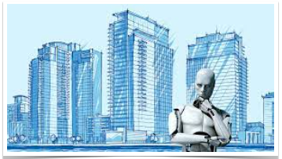

# Smart_Home_Object_Detection
Write<b> By Mohammad Reza Nilchiyan</b>

This is for security reasons in smart-home

## The Future Of Design
What the proposal purports to do :

• Define the Aims 

• State of the art  

• Partly-Literature Review

• Structure work package

       -  1 Why it solves a problem and meets a need.
        
       -  2 What main features and elements make it truly stand out?
        
       -  3 Why this will benefit the recipients and represent an excellent solution.

It's fascinating to envision how the rise of contagious diseases like COVID-19 is reshaping lifestyles, consequently influencing the trajectory of future living and work environments, especially in the realm of smart homes. The convergence of architectural design and cutting-edge technology is currently focused on cultivating a seamlessly convenient and secure lifestyle ahead. With the surge in remote work arrangements, the demand for spaces that provide tranquility, privacy, heightened security, health monitoring, and sanitation has escalated, presenting an initial challenge. Additionally, looming on the horizon is the potential significant upheaval brought about by climate change, necessitating robust cooperation with industries and the implementation of renewable energy systems (EIRES) to mitigate its impact. Each individual bears a responsibility to combat global warming and its repercussions, as emphasized by Joseph Stiglitz, a Nobel Prize laureate, who underlines how penalties imposed on companies for emitting climate-warming greenhouse gases can catalyze a shift towards greener practices, influencing even the financial stability of fossil fuel sectors and their financial supporters.

Another pressing concern pertains to the precise and regular monitoring of health conditions, particularly in light of the rising instances of fatalities during sleep and routine activities within homes. Current dwellings are far from optimal in terms of comfort, safety, and healthiness. In summary, this research strives to positively address societal challenges encompassing comfort, safety, energy efficiency, mobility, and healthcare. Within this context, a key objective of the proposed research is to foster a platform for novel ideas and recent advancements in AI/ML techniques for the realm of intelligent homes.

The allure of residing farther from urban centers and workplaces has garnered considerable attention, driven not so much by a desire for larger residences but primarily by the aspiration for more functional and adaptable abodes. The impact of our built environment on all facets of life cannot be underestimated. The notion of a smart home emerged with hindsight, blending sensor technology with networked living spaces, yet there's an acknowledgment that more is needed. Contrary to the prevalent industrial automation-oriented smart-building platforms, the research at hand takes a distinct approach. It seeks to harmonize disparate elements of our living space through technical aids, envisioning a scenario where a smart dwelling not only manages appliances but also orchestrates activities akin to a responsive robotic system. This technology bestows convenience, energy savings, and a sense of fulfillment, simulating a nurturing entity that oversees health conditions, and entertainment setups, and even acts promptly during emergencies. This vision necessitates the interconnectivity of smart devices forming an Internet of Things (IoT) ecosystem, particularly vital for health monitoring, where aggregated data from in-home devices informs pertinent authorities.

The active users of smart home solutions are projected to reach 77 million by 2025, marking a significant upswing. Beyond the core drivers of security, efficiency, and monitoring services, the integration of AI into smart devices opens new vistas for businesses leveraging the synergy between technology and architecture. The global market for smart home solutions, valued at approximately $24 billion during the 2016 international home automation exhibition, is anticipated to surge to $45.8 billion in the following year.

Current Landscape:
Over the years, diverse biometric authentication methods such as intracellular DNA, facial recognition, fingerprint identification, hand measurements, iris recognition, and voice and signature analysis have been employed to ascertain user identities. The evolution of biometric security systems, driven by advancements in private security, underscores the significance of such technologies. However, their processes and accuracy vary based on application. This study aims to explore the correlation between smart home solutions and the potential for unintended consequences. The research revolves around Bio detections, harmonizing facial recognition, signature identification, and pulse monitoring—widely accepted biometric methods for both security and wellness assessments. By harnessing robust monitoring and precise data analysis, potential irregularities in machine learning can be mitigated. Another primary goal of this research proposal is to serve as a hub for novel concepts and contemporary developments in AI/ML strategies tailored for intelligent dwellings.

The bedrock of all machine-learning security systems is comprehensive data. Ensuring high-security access necessitates adept data collection, preprocessing, feature extraction, and selection. This underscores the significance of digitalization and data mining, offering a platform for intelligent refinement and optimization. The assimilation of diverse AI techniques further enhances the quality of our living environment.

Implementing new smart home technology endows homeowners with enhanced security, convenience, and caretaking capabilities. Beyond controlling electronic devices, appliances, and utility systems, smart entry systems empower homeowners to manage their properties remotely. These systems can even gauge psychological and emotional states, prompting corresponding adjustments to the environment—a facial recognition system detecting stress might signal the coffee machine to brew a comforting cup, while the bathroom prepares a warm bath and soothing music plays. Face recognition serves as the initial trigger, but a multi-faceted approach is employed, including individual signatures that open doors and are indicative of one's overall condition. This research delves into unconventional domains encompassing automation, control systems, locomotion, mechatronics, and artificial intelligence.

(machine learning / deep learning), electronics, computer sciences, design, and user interfacing.
        

# How to deploy Model

The focus is on deep learning object detection using TensorFlow. 

## The following key aspects:

### Projects Overview:
The video demonstrates the creation of four different object detection models using TensorFlow:

- Item 1 Gesture Detection: This project involves building a model that can detect four different hand gestures.
- Item 2 Face Sentiment Detection: In this project, the video explains how to use TensorFlow Object Detection to estimate facial sentiment, which likely means recognizing emotions on people's faces.

### Learning Objectives:
The video aims to teach viewers the following skills:
    -  1 TensorFlow Object Detection on a Local Machine: This involves setting up TensorFlow for object detection tasks on your local computer.
    -  2 Image Collection and Labeling: The video explains how to gather and label images for object detection using a tool called LabelImg.
    -  3 Training Deep Learning Models: The tutorial covers the process of training deep learning object detection models using Python and the TensorFlow Object Detection library.
    -  4 Real-time Object Detection: 
The video demonstrates how to use the trained models to perform real-time object detection using a webcam and static images.

Please note that while the video provides an overview of these topics, the detailed steps and code are likely covered in the video itself. If you're interested in deploying models, particularly TensorFlow Object Detection models, you can follow these general steps:

## Deploying a Model:
    -  1 Train the Model: Use the labeled dataset to train the object detection model using TensorFlow. This involves creating and configuring the model architecture, feeding in the training data, and adjusting parameters for optimal performance.
    -  2 Export the Model: Once the model is trained, export it in a format suitable for deployment. TensorFlow provides tools to convert trained models into formats that can be used for inference.
    -  3 Inference on New Data: Use the exported model to perform object detection on new images or video frames. This is where the model predicts the presence and location of objects in the given input.
    -  4 Integration: Depending on your use case, you might integrate the model with different applications. This could involve deploying the model on a server, embedding it in an application, or running it on edge devices.
    -  5 Real-Time Object Detection: As mentioned in the video, you can use the trained model to perform real-time object detection using input from sources like webcams.

